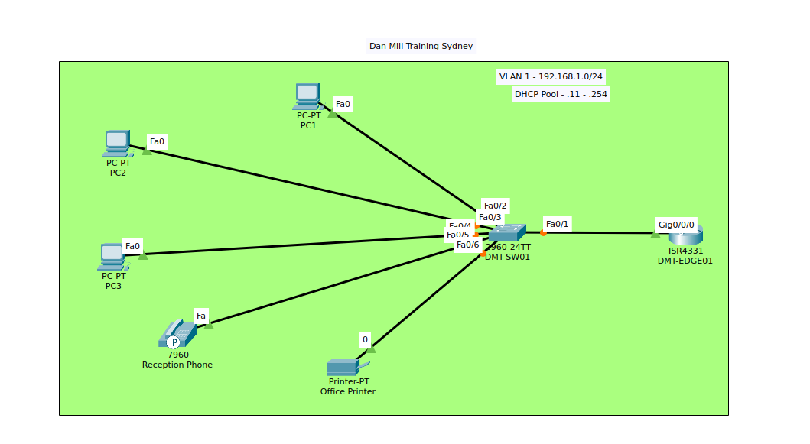

En este laboratorio el objetivo es brindar direccionamiento dinámico por DHCP en un router ISR 4331.
El laboratorio es el siguiente:



Para ello hay que definir 2 cosas antes: 
1. **Encender la interfaz del router que esta conectado al switch (por defecto viene apagado)**
2. **Definir una dirección ip estatica a la interfaz G0/0/0** (en este caso la .1).

Una vez hecho eso podemos configurar dhcp server en el router
# 1. Indicar las direcciones que NO van a formar parte del pool dhcp

```
ISR4331(config)# ip dhcp excluded-address 192.168.0.1 192.168.0.10 
```
# 2. Crear el pool DHCP 
```
ISR4331(config)# ip dhcp pool VLAN1-POOL
ISR4331(config)# network 192.168.0.0 255.255.255.0
ISR4331(config)# default-router 192.168.0.1 # ip del router 
ISR4331(config)# dns-server 8.8.8.8  
```

Una vez hecho esto los equipos deberian tener direccionamiento automatico.
