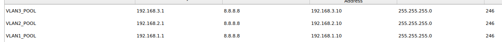

En este laboratorio debemos configurar el dhcp relay para que el router entregue el dhcp discover a los gateway de cada VLAN.

# Paso 1: Configurar los 3 pool correspondientes a las VLAN

Entramos al servidor DHCP, se abrirá una GUI y creamos los pool.



# Paso 2: Definir las direcciones a excluir 

En este caso seria las direcciones de los gateway, que hay que configurar manualmente:
Primero hay que entrar a la subinterfaz, el identficador puede ser cualquiera en este caso para poder identificarlo fácilmente ponemos el id de la vlan. 

```
VLAN 1
ISR4331(config)# interface g0/0/0.1
ISR4331(config-sub-int)# encapsulation dot1q 1 # id de vlan 
ISR4331(config-sub-int)# ip address 192.168.1.1 255.255.255.0
ISR4331(config-sub-int)# ip helper-adress 192.168.2.2 # servidor dhcp 
VLAN 2
ISR4331(config)# interface g0/0/0.2
ISR4331(config-sub-int)# encapsulation dot1q 2 # id de vlan
ISR4331(config-sub-int)# ip address 192.168.2.1 255.255.255.0
ISR4331(config-sub-int)# ip helper-adress 192.168.2.2
VLAN 3
ISR4331(config)# interface g0/0/0.3
ISR4331(config-sub-int)# encapsulation dot1q 3 # id de vlan
ISR4331(config-sub-int)# ip address 192.168.3.1 255.255.255.0
ISR4331(config-sub-int)# ip helper-adress 192.168.2.2
ISR4331(config-sub-int)# exit  # salimos de la sub interfaz
ISR4331(config)# no shutdown # encendemos la interfaz
```


# Paso 3: Definir trunk entre DMT-SW01 y router DMT-EDGE01

```
DMT-SW01(config)# interface g0/1
DMT-SW01(config-int)# switchport mode trunk
DMT-SW01(config-int)# switchport trunk allowed vlan 1,2,3 
```

# Paso 4 : Definir VLAN y asignar las interfaces correspondientes

1. Creamos las vlans
```
DMT-SW01(config)# vlan 2
DMT-SW01(config-vlan)# vlan 3
DMT-SW01(config-vlan)# exit
```

2. Asignar vlan a los puertos

```
DMT-SW01(config)# interface f0/1
DMT-SW01(config-int)# switchport mode access
DMT-SW01(config-int)# switchport access vlan 2

DMT-SW01(config)# interface range f0/2-3
DMT-SW01(config-int)# switchport mode access
DMT-SW01(config-int)# switchport access vlan 1

DMT-SW01(config)# interface range f0/4-5
DMT-SW01(config-int)# switchport mode access
DMT-SW01(config-int)# switchport access vlan 3
```


Con eso concluye este laboratorio