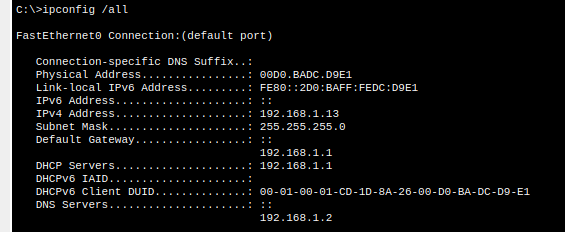
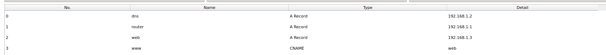
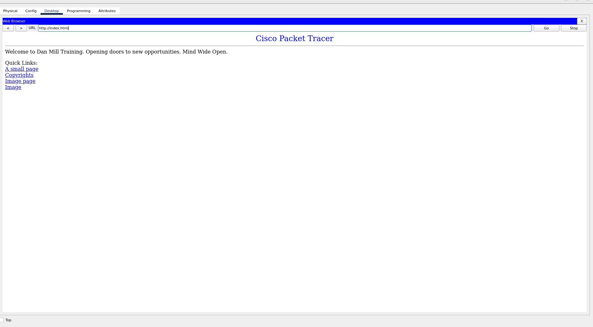

En este escenario, los equipos no pueden conectarse al sitio web alojado en el servidor web

Si revisamos el servidor dns tiene la direccion ip 192.168.1.2, y todas las PC pertenecen a esa misma subred y el servidor dns apunta a esa direccion: 

En packet tracer existe una manera de ver el trafico visualmente si vamos en el apartado **simulation** abajo a la derecha, sin embargo, en ambientes reales no tenemos esa opción, por lo que es bueno conocer una herramienta de la linea de comandos conocida como traceroute que nos permite ver el recorrido de un paquete de un punto a otro, a diferencia de **ping** que sirve para verificar conectividad de extremo a extremo, traceroute nos permite ver hasta que punto un paquete se pierde y ver el alcance, eso nos facilita a la hora de hacer *troubleshooting*.

A nivel ip todo parece bien, por lo que solo nos quedaria ver las entradas del servidor dns y vemos lo siguiente: 

Si notamos, vemos que en este caso, el servidor dns apunta los nombres router, web y www a 192.168.1.2, 192.168.1.1 y 192.168.1.3 respectivamente, es por eso que al escribir "index.html" o "helloworld.html" el dns no logra resolver el nombre del dominio, por lo que solo debemos cambiarlo. 
de web, cambiemoslo a un archivo que existe en el servidor web, en este caso "index.html".
Con eso ya podemos visualizar el contenido de la web y el **hello world**

Archivo **index.html**

Archivo **index.html/helloworld.html**

Con eso concluye el laboratorio 